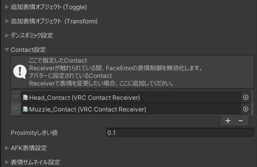

# 何ができるの？
・ルル君が撫でられたときに表情が変わるようになります  
・MMDをONにすると撫でられても表情が変わらなくなります  
  
  
# 注意事項など
・対応アバターはらすちんワークス様の[ルル (Lulu)](https://aoikarasu.booth.pm/items/4271776)です  
・MMDボタンを削除している場合は撫でられたときに表情が変わらない可能性があります  
・デフォルトでは自分で触れても反応しないようになっています  
&emsp;(ContactのAllow Selfにチェックを入れると自分で触れても反応するようになります)
  
# 導入手順
1.&nbsp;[Modular Avatar](https://modular-avatar.nadena.dev/ja)をプロジェクトに追加します  
  
2.&nbsp;[Releases](https://github.com/Luke-514/Lulu_Nade/releases/latest)からLulu_Nade.unitypackageをダウンロードして、プロジェクトにインポートします  
  
3.&nbsp;Assets>Lulu_Nadeの中にある**Lulu_nade.prefab**をアバター直下に追加します  
  
4.&nbsp;Assets>Lulu_Nadeの中にある**Head_Contact.prefab**と**Muzzle_Contact.prefab**を  
&emsp;**Armature→Hips→Spine→Chest→Neck→Head**の中に追加します  
  
  
# 導入後の注意事項
・FaceEmoを使用されている場合は、Contact設定にHead_ContactとMuzzle_Contactを追加する必要があります  
  
・VRCQuestToolでQuest対応させる場合は、Contact Senders & Receivers to Keepに  
&emsp;Head_ContactとMuzzle_Contactを追加する必要があります  
  
  
# 参考
ケーキのPC情報集会所  
【VRChat】撫でられたら喜んじゃう！Contact機能を使ってみた！  
https://keiki002.com/vr/vrchat-contact/  
  
# 免責事項
本アセットの使用によって発生した、いかなる損害に対しても作者は一切の責任を負いません  
  
# 利用規約
本アセットの改変・二次配布を許可します  
(二次配布を行う際はクレジットに作者の名前を記載していただけると嬉しいです)  
  
# 作者
Luke514  
  
# Special Thanks
優希@白狼わんこ  
  
# 寄付

